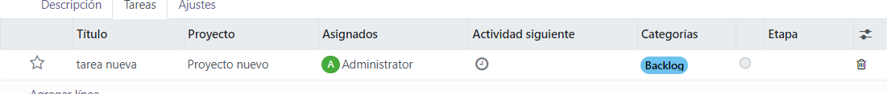
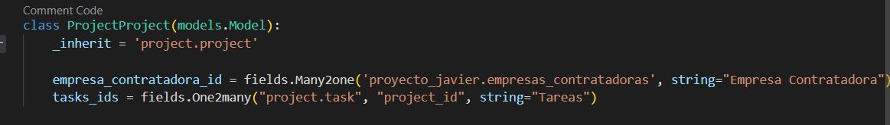

# Proyecto Javier

Al instalar el módulo, se debe de instalar también el módulo de proyecto ya que dependemos de él.

Cuando se instala, deberemos entrar en la configuración del usuario y seleccionar que el usuario es administrador, además, tendremos varios grupos de usuarios más, como jefe de proyectos, analista y programador, por lo tanto quitaremos de Proyectos en la parte superior izquierda el selector de proyectos y lo dejamos en blanco para que todos los permisos funcionen correctamente

Ahora sí podremos ir al módulo, una vez entramos al módulo veremos la vista tree de las empresas contratadoras.

Cuando seleccionamos en nuevo nos aparecerá la vista de formulario de las empresas contratadoras con sus respectivos campos

Rellenamos los campos y vemos que el campo de tipo de empresa está en gris, eso es porque es un campo calculado, este se calcula con la cantidad que se ponga en el de numero de empleados, a más número de empleados, más grande es la empresa, por lo que variará entre pequeña, mediana y gran empresa

También vemos que está la vista tree heredada de los proyectos que tiene la empresa, esto es debido a que tenemos un campo oneToMany asociado a los proyectos en el modelo de las empresas contratadoras, ahí se podrán agregar nuevos proyectos, probamos a agregar uno:

Rellenamos los datos y se agregan correctamente a la empresa contratadora correspondiente

Ahora si queremos agregar una tarea vamos a poder agregarla seleccionando el proyecto que queremos y agregar la tarea desde la pestaña de tareas:

y podemos agregarlas: 

agregando una tarea podremos elegir la categoría que tiene, en este caso se elige backlog. Esto está hecho mediante la carga previa de datos.

Una vez hecho esto se ha agregado correctamente.

Finalmente toda la estructura principal ya está explicada, las vistas de los proyectos y las tareas están heredadas además dentro de los formularios de las empresas contratadoras y los proyectos también en las pestañas de la parte superior de la pantalla desde la que podemos acceder.

Ahora crearemos un reporte de una empresa contratadora, esta mostrará los datos de la empresa y los proyectos que tiene esa empresa:

En la parte superior derecha de la pantalla se ve imprimir, cuando le damos aparecerá el reporte hecho:

Vemos que está realizado el reporte con el nombre de los proyectos y el numero de tareas que tienen:

Finalmente quedaría ver los permisos de los usuarios, para ello tenemos que cambiar los ajustes para poder ver los permisos que tendrían:

Si ponemos al usuario como jefe de proyectos se ejecutarán las mismas acciones explicadas en el administrador ya que tiene permisos para hacer todos los crud de los proyectos, tareas y empresas_contratadoras.

Ahora cambiamos a analista, tendremos la posibilidad de ver las empresas contratadoras y los proyectos, pero no podremos modificarlos, donde podremos hacer el crud completo será de las tareas:

De las demás vistas no podremos modificar nada, solo ver

Finalmente si entramos como programadores solo podremos ver los proyectos y las tareas, pero no podremos hacer el crud de los proyectos y no podremos agregar ni borrar tareas, solo modificarlas.

Aquí vemos una tarea, que actualizamos la categoría de backlog a ready:

Tarea actualizada:

A continuación se muestra cada una de las vistas y las demás acciones realizadas:

Modelos:

Empresas contratadoras

Proyecto (heredado):

Tareas (heredado):

Vistas:

Empresas contratadoras:

Proyectos con tareas heredadas:

Acciones:

Elementos de menú:

Carga previa de datos:

